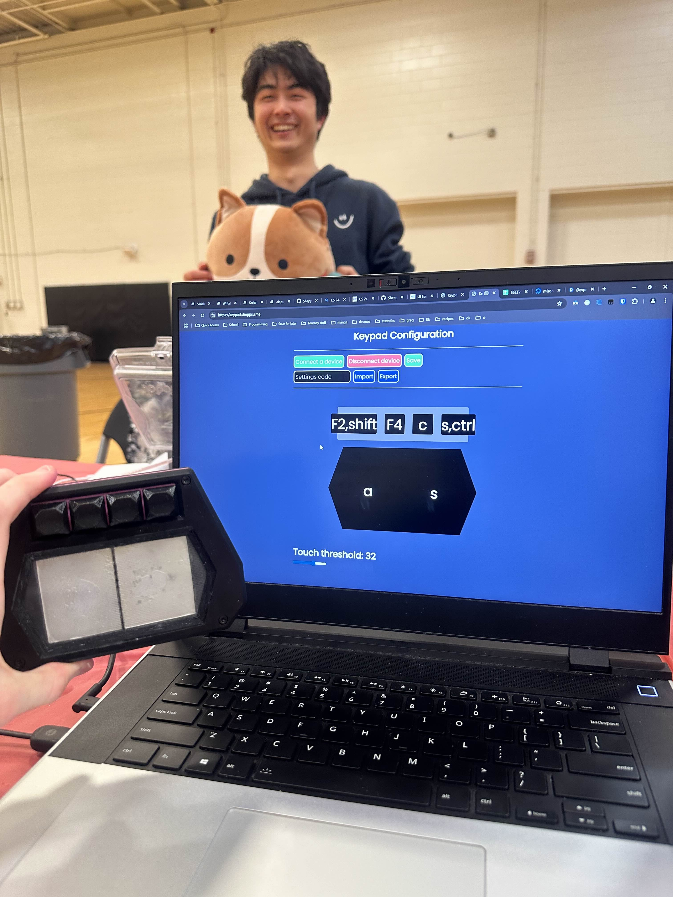

# osu! configurable keypad
A custom-designed keypad for the rhythm game "osu!" with a [website](https://keypad.sheppsu.me) for configuring the keys and touch sensitivity.

## Inspiration
Keypads are fairly popular in the osu! community and the design is partly based on the input controller used in another game "Chunithm."

## What it does
It has 2 keys for playing the game and 4 utility keys for other functions, such as navigating the game. It comes with a website that connects to the device via USB and can configure the keys and touch sensitivity.

## How we built it
There are two major parts of the project: the keypad and website. The keypad hardware was designed in Fusion 360 and printed on a Prusa MK4 3D printer.  The keypad firmware was written in C++ for an RP2040 microcontroller using the PicoCapSensing library to manage the capacitive sensing for the two main buttons and other built-in libraries for saving settings to onboard memory and sending keystrokes over USB.  The overall logic flow of the firmware was built on an osu! keypad library one of our group members developed while making keypads in the past. The website was created using html, css, and javascript, and is entirely a frontend project. The backend is a simple nginx server that serves the files. The website uses the Web Serial API to communicate with the keypad. Javascript drives the frontend user interaction.

## Challenges we ran into
We had never used the Web Serial API before, so we had to start by reading through the documentation and running some example code to get the hang of it. We had also never used serial communication on an RP2040 microcontroller beyond printing simple error messages for debugging, so we had to scour the arduino documentation to figure out sending, receiving, and managing commands.

## Accomplishments that we're proud of
We're proud that the we were able to achieve our goal for the project: having a completely configurable keypad via website that functions well.

## What we learned
We learned about establishing serial communication to a device from a website. We also learned about reading and storing serial data on the keypad device, as opposed to simply writing serial data.

## What's next for osu! configurable keypad
Streamlining serial communication and switching to a more robust storage medium in order to support creating and binding multiple macros.

# Repository layout
- `KappaPad_Chuni` contains the firmware of the keypad and CAD file
- `keypad` contains the static files of the website

## Running locally
- The firmware can be setup with the PicoSDK for the arduino
- The website can be run with nginx or any static file serving server
  - If using nginx, check example.config.nginx
  - For local development, remove ssl related configuration and it'll (probably) work